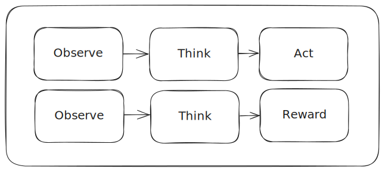

# R1 Computer Use

Applying the ideas of [Deepseek R1](https://github.com/deepseek-ai/DeepSeek-R1) and [Open R1](https://github.com/huggingface/open-r1) to computer use.

## Overview

The primary challenge of this project is providing robust enough reward signals to induce reasoning. R1 relies heavily on hard-verifiable rewards, which are not available at scale in real world GUI interactions.

R1-Computer-Use implements a novel architecture where both actor and reward models explicitly reason about computer interactions. Based on insights from DeepSeek-R1 and OpenR1, we demonstrate that explicit reasoning in both models leads to more robust and interpretable computer use.

## Architecture

Both models follow a three-step cycle which can be seen as an extention of [ReACT](https://react-lm.github.io/) into reinforcement learning.




## Agent

```python
observation = "Current directory contains: setup.py requirements.txt"
reasoning = """
1. Project appears to be a Python package
2. No virtual environment detected
3. Should create venv before proceeding
"""
action = "python -m venv .venv"
```

## Reward Model

```python
analysis = """
1. Correctly identified project type
2. Appropriate prerequisite check
3. Standard venv location chosen
"""
reward = 0.85
```

## Usage

```python
from r1_computer_use import Agent, RewardModel

agent = Agent()
reward_model = RewardModel()

result = agent.run(
    task="Set up Python development environment",
    observe_reasoning=True
)

feedback = reward_model.evaluate(
    actions=result.actions,
    reasoning=result.reasoning
)
```

## Training

The training pipeline implements Group Relative Policy Optimization (GRPO) in multiple stages:

1. **Cold Start**
   - Expert demonstrations with reasoning traces
   - Initial reward model training
   - Base model fine-tuning

2. **Reasoning-Focused GRPO**
   ```python
   # Generate group of solutions for each task
   solutions = agent.generate_solutions(task, n_samples=16)
   
   # Calculate advantages using reward model
   advantages = reward_model.batch_evaluate(solutions)
   advantages = (advantages - advantages.mean()) / advantages.std()
   
   # Update policy using GRPO
   loss = grpo_update(
       policy=agent,
       solutions=solutions,
       advantages=advantages,
       clip_ratio=0.2,
       reference_kl=0.1
   )
   ```

3. **Rejection Sampling Stage**
   - Filter top-k solutions based on reward model
   - Create new training dataset from best examples
   - Fine-tune base model on filtered data

4. **General GRPO**
   - Apply GRPO to full task distribution
   - Balance reasoning and task completion
   - Optimize reward model in parallel

Key training parameters:
```python
training_config = {
    'cold_start_steps': 10000,
    'grpo_batch_size': 16,
    'grpo_epochs': 1000,
    'rejection_sampling_threshold': 0.8,
    'kl_target': 0.01,
    'max_grad_norm': 1.0
}
```

5. **Evaluation**
   - Task completion metrics
   - Reasoning quality assessment 
   - Safety verification
   - Distribution shift analysis


## Research
Current areas of investigation:

- Reward model architectures
- Base model evaluations

## License
MIT

## Citation

```bibtex
@software{r1_computer_use,
  title     = {R1-Computer-Use: Reasoning-First Computer Interaction},
  author    = {Barker, Patrick},
  year      = {2025},
  url       = {https://github.com/agentsea/r1-computer-use},
}
```